# Implementation-of-Logistic-Regression-Model-to-Predict-the-Placement-Status-of-Student

## AIM:
To write a program to implement the the Logistic Regression Model to Predict the Placement Status of Student.

## Equipments Required:
1. Hardware – PCs
2. Anaconda – Python 3.7 Installation / Moodle-Code Runner

## Algorithm
1. Start the program
2. Import the python library pandas
3. Read the dataset of Placement_Data
4. Copy the dataset in data1
5. Remove the columns which have null values using drop()
6. Import the LabelEncoder for preprocessing of the dataset
7. Assign x and y as status column values
8. From sklearn library select the model to perform Logistic Regression
9. Print the accuracy , confusion matrix and classification report of the dataset
10. Stop the program

## Program:
```
/*
Program to implement the the Logistic Regression Model to Predict the Placement Status of Student.
Developed by: m.santhosh
RegisterNumber:212220040146
import pandas as pd
data = pd.read_csv("/Placement_Data.csv")
data.head()
data1 = data.copy()
data1 = data1.drop(["sl_no","salary"],axis=1)           
data1.head()
data1.isnull().sum()    
data1.duplicated().sum()
from sklearn.preprocessing import LabelEncoder
le = LabelEncoder()
data1["gender"] = le.fit_transform(data1["gender"])
data1["ssc_b"] = le.fit_transform(data1["ssc_b"])
data1["hsc_b"] = le.fit_transform(data1["hsc_b"])
data1["hsc_s"] = le.fit_transform(data1["hsc_s"])
data1["degree_t"] = le.fit_transform(data1["degree_t"])
data1["workex"] = le.fit_transform(data1["workex"])
data1["specialisation"] = le.fit_transform(data1["specialisation"])
data1["status"] = le.fit_transform(data1["status"])
print(data1)
x = data1.iloc[:,:-1]
print(x)
y = data1["status"]
print(y)
from sklearn.model_selection import train_test_split  
x_train,x_test,y_train,y_test = train_test_split(x,y,test_size = 0.2,random_state = 0)
from sklearn.linear_model import LogisticRegression
lr = LogisticRegression(solver = "liblinear")           #liblinear-library for larger linear classification
lr.fit(x_train,y_train)
y_pred = lr.predict(x_test)
print(y_pred)
from sklearn.metrics import accuracy_score
accuracy = accuracy_score(y_test,y_pred)
print(accuracy)
from sklearn.metrics import confusion_matrix
confusion = confusion_matrix(y_test,y_pred)
print(confusion)
from sklearn.metrics import classification_report
classification_report1 = classification_report(y_test,y_pred)
print(classification_report1)
lr.predict([[1,80,1,90,1,1,90,1,0,85,1,85]])
*/
```

## Output:
Original data(first five columns):
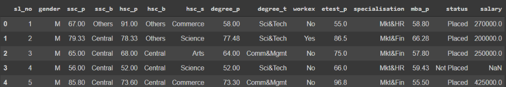
Data after dropping unwanted columns(first five):
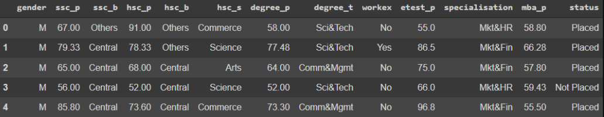

Checking the presence of null values: 

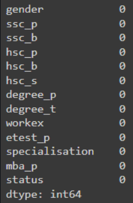

Checking the presence of duplicated values: 


Data after Encoding: 

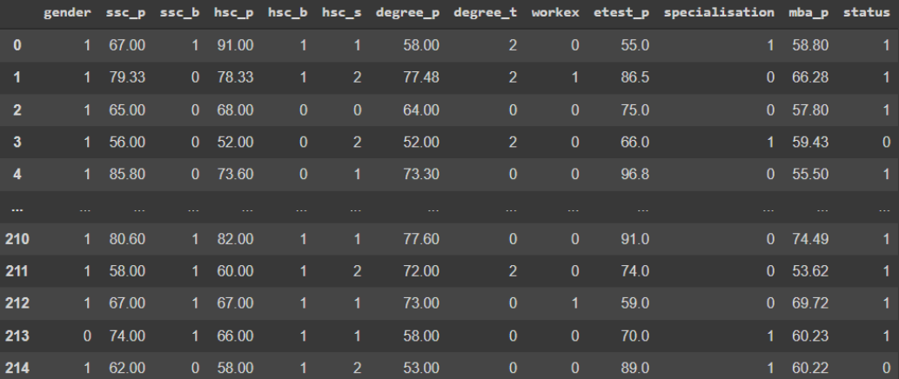
X Data: 
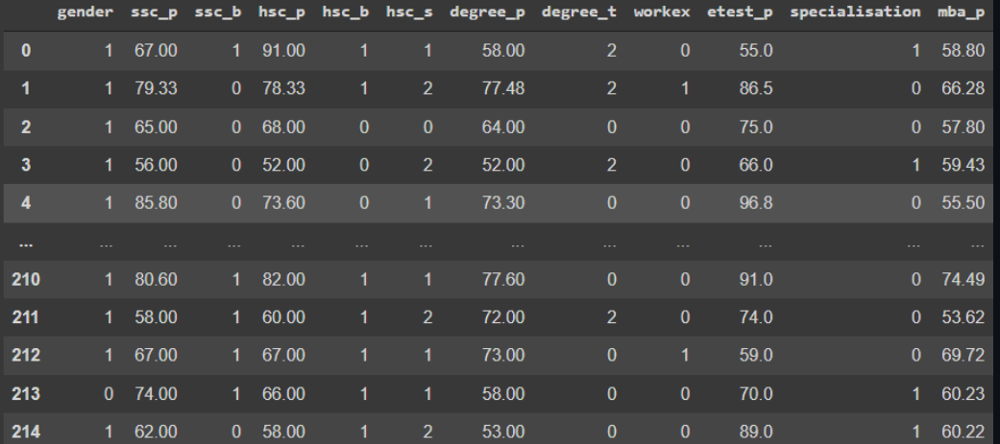
Y Data: 

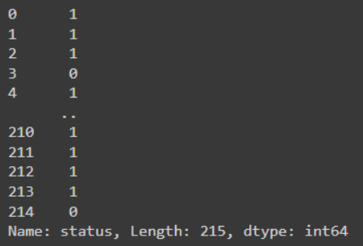

Predicted Values: 

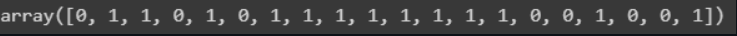

Accuracy Score: 

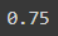

Confusion Matrix: 

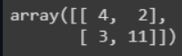

Classification Report: 

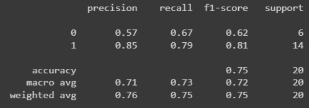

Predicting output from Regression Model: 

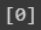

## Result:
Thus the program to implement the the Logistic Regression Model to Predict the Placement Status of Student is written and verified using python programming.
